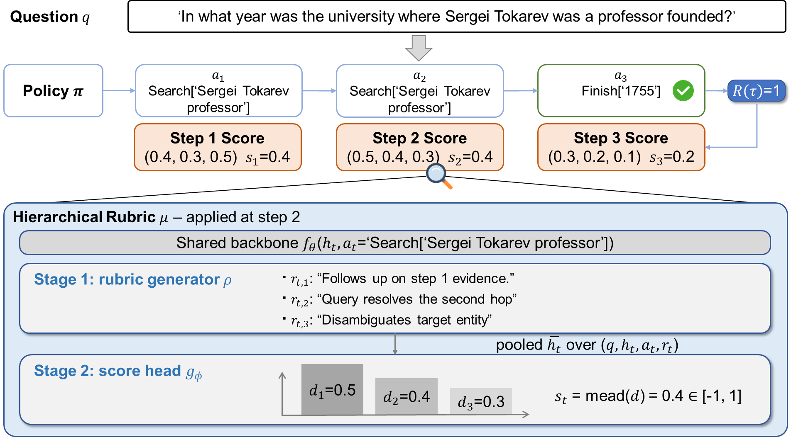

<h1 align="center">ARCO: Adaptive Rubric Co-Evolution for Multi-Step LLM-Based Agents</h1>

<p align="center">
  <a href="https://github.com/zihangtian/ARCO"></a>
</p>

---

## 📌 Introduction

**ARCO** (Adaptive Rubric CO-evolution) trains multi-step LLM agents with **interpretable, step-level process rewards**. A single rubric model `μ` shares a backbone between a generation head that emits `K=3` natural-language criteria per step and a score head that returns rubric-conditioned step rewards. A trajectory-decomposition constraint ties the sum of step rewards to the binary outcome reward, so `μ` and the policy `π` are co-optimized on the same on-policy rollouts — without any external judge.

<p align="center">
  
</p>

ARCO has three properties that distinguish it from prior reward-modeling work:

* **Step-level rubrics.** Existing rubric methods score at the trajectory level; ARCO writes a fresh checklist for every action and scores the action under that checklist.
* **Trainable, same-scale evaluator.** No frozen closed-source judge — `μ` is an open-source LM that learns alongside the policy.
* **Co-evolution at the parameter level.** Both the rubric content and the scoring function are updated by gradients, on the same on-policy data that updates `π`.

This repository ships the minimal implementation for the **HotpotQA + Qwen3-4B** setting from the paper.

---

## 🛠️ Environment Setup

We recommend [Conda](https://docs.conda.io/en/latest/).

```bash
# 1. Create a new conda environment with Python 3.10
conda create -n arco python=3.10 -y

# 2. Activate the environment
conda activate arco

# 3. Install dependencies
pip install -r requirements.txt
```

A CUDA build of `torch` matching your driver is required. ARCO trains with LoRA in `bf16`; one 80 GB GPU is enough for Qwen3-4B, two GPUs (one for `π`, one for `μ`) make the dense stage faster.

---

## 💾 Data & Models

### Datasets

Place the original HotpotQA corpus under `data/hotpotqa/`:

```bash
mkdir -p data/hotpotqa
wget -O data/hotpotqa/hotpot_train_v1.1.json \
  http://curtis.ml.cmu.edu/datasets/hotpot/hotpot_train_v1.1.json
wget -O data/hotpotqa/hotpot_dev_distractor_v1.json \
  http://curtis.ml.cmu.edu/datasets/hotpot/hotpot_dev_distractor_v1.json
```

> **Note:** the 2k / 500 splits we trained on, the GPT-annotated warmup trajectories, and the derived `π` / `μ` SFT data are all included under `data/hotpotqa/splits/` and `data/hotpotqa/output/`. You can skip warmup collection and go straight to the RL stage with the shipped jsonl files.

### Pre-trained Models

The code reads model paths from `configs/hotpotqa/hotpotqa.yaml` and `configs/hotpotqa/arco_qwen.yaml`. By default it pulls from Hugging Face:

* `Qwen/Qwen3-4B-Instruct-2507` — backbone for both `π` and `μ`
* `princeton-nlp/unsup-simcse-roberta-base` — local SimCSE retriever

**Using Local Weights:**
If you have mirrored these weights locally, replace the strings above in the two YAMLs with your absolute paths.

### API Key (warmup only)

Stage 1 (warmup collection) calls a GPT teacher. Set your key in `configs/hotpotqa/hotpotqa.yaml` → `api.api_key`. **You can skip this entirely** if you reuse the shipped warmup jsonl.

---

## 🚀 Quick Start

End-to-end pipeline:

```bash
bash scripts/run/hotpotqa/run_arco_qwen.sh
```

The script chains the four stages below. Run them individually if you want fine control.

### Step 0: Launch the SimCSE Retriever

```bash
CUDA_VISIBLE_DEVICES=0 python scripts/deploy_retriever.py \
  --config configs/hotpotqa/hotpotqa.yaml
```

The service listens on `http://127.0.0.1:2022/retrieve`. The port is set in `configs/hotpotqa/hotpotqa.yaml` → `retriever.port`.

### Step 1: Collect Warmup (skip if using shipped jsonl)

```bash
python scripts/collect_warmup.py --config configs/hotpotqa/hotpotqa.yaml
```

This drives a GPT teacher through HotpotQA training questions and dumps trajectories + per-step rubrics to `data/hotpotqa/output/warmup_records.jsonl`.

### Step 2: Warmup-SFT the Policy `π`

```bash
CUDA_VISIBLE_DEVICES=0 python scripts/sft_pi.py \
  --config configs/hotpotqa/pi.yaml
```

`π` is initialized to imitate the high-reward warmup trajectories.

### Step 3: Warmup-SFT the Rubric Model `μ`

```bash
CUDA_VISIBLE_DEVICES=0 python scripts/sft_mu.py \
  --config configs/hotpotqa/mu.yaml
```

`μ` is trained with a dual objective — an LM loss on rubric text and an MSE on projected criterion scores so that the trajectory-decomposition constraint holds at warmup.

### Step 4: ARCO Co-Evolution RL

```bash
python scripts/rl_train.py --config configs/hotpotqa/arco_qwen.yaml
```

The RL trainer follows a sparse-to-dense schedule: the first few epochs use the binary outcome reward only (so `μ` catches up to the fresh rollouts), then `π` is trained with reward-to-go advantages from `μ`'s step scores using a position-bucketed baseline, while `μ` is updated by trajectory-decomposition MSE plus KL to its warmup reference.

> **Tip:** `vLLM` rollout is enabled by default in `configs/hotpotqa/arco_qwen.yaml` (`vllm.enabled: true`, `max_model_len: 8192`). Disable it if your GPU memory is tight.

---

## 📂 Repository Layout

```
ARCO/
├── README.md
├── requirements.txt
├── src/                          # ARCO framework
│   ├── agents/                   # policy / rubric agent
│   ├── environments/             # HotpotQA env + dataset registry
│   ├── training/                 # rl_trainer, dual_head_mu, sft_trainer, vllm_engine, ...
│   └── utils/                    # retriever, metrics, prompt builders, api client
├── scripts/
│   ├── collect_warmup.py         # GPT-teacher warmup collection
│   ├── sft_pi.py / sft_mu.py     # Warmup SFT for policy and rubric model
│   ├── rl_train.py               # Co-evolution RL
│   ├── deploy_retriever.py       # SimCSE retriever service
│   └── run/hotpotqa/run_arco_qwen.sh
├── configs/hotpotqa/
│   ├── hotpotqa.yaml             # Dataset / API / retriever
│   ├── pi.yaml                   # Policy SFT config
│   ├── mu.yaml                   # Rubric model SFT config
│   └── arco_qwen.yaml            # ARCO RL config (vLLM enabled, max_model_len=8192)
├── prompts/                      # Policy / rubric / shared prompt templates
└── data/hotpotqa/
    ├── splits/                   # train_2k.jsonl, dev_500.jsonl
    └── output/                   # GPT warmup + π / μ SFT data
```
